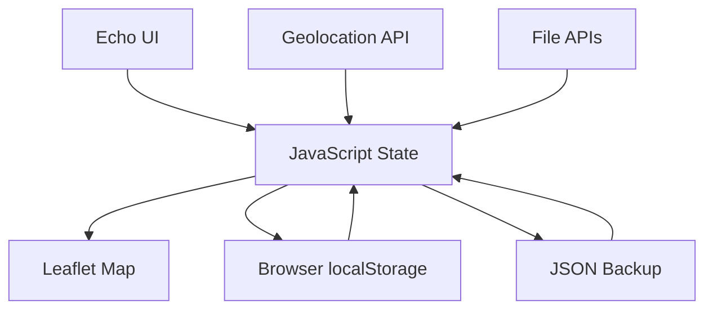

# Echo — Project Overview

## 1. Project Summary

Echo is a local-first interactive memory map built with HTML, CSS, and vanilla JavaScript. It allows users to attach personal stories to geographic locations and manage those stories through a visual map and archive interface.

The application combines mapping, browser storage, geolocation, file handling, search, filtering, and responsive UI into one frontend project.

## 2. Core Concept

The central idea is simple:

> A place can hold a memory.

A user selects a point on the map, creates an Echo containing a title, story, author name, and optional photo, and saves it locally.

## 3. Main Components

### Map
Leaflet provides the interactive map and markers.

### Story Manager
JavaScript manages creation, editing, deletion, favorites, searching, and filtering.

### Storage Layer
Browser localStorage persists Echo objects between sessions.

### Backup Layer
The application serializes Echo data into JSON for export and restores it through JSON import.

### Location Layer
The Geolocation API can locate the user and use the current position when creating an Echo.

## 4. Data Model

A typical Echo contains:

```text
{
  id,
  lat,
  lng,
  title,
  story,
  author,
  date,
  photo,
  favorite
}
```

## 5. Architecture



## 6. Privacy Model

The current architecture is local-first:

```text
Browser
  ↓
Echo application
  ↓
localStorage
  ↓
User's local archive
```

There is no project backend or account system in the current implementation.

This reduces the need for server-side infrastructure, but localStorage should not be treated as encrypted or highly secure storage.

## 7. Key Engineering Decisions

### Local-first persistence
Using localStorage keeps the project simple and allows the core experience to work without a custom backend.

### Client-side rendering
Story cards, map markers, modal content, and filters are rendered dynamically with JavaScript.

### JSON portability
Export/import gives users a basic way to move or back up their local archive.

### Progressive enhancement
Geolocation is used when supported, while the application remains usable without it.

## 8. Current Limitations

- No authentication
- No cloud synchronization
- No server-side database
- localStorage size limitations
- Photos are stored as data URLs
- Map tiles require network access
- No end-to-end encryption
- No multi-device synchronization

## 9. Skills Demonstrated

- HTML5
- CSS3
- JavaScript
- Leaflet.js
- DOM manipulation
- localStorage
- JSON
- Geolocation API
- FileReader API
- Responsive design
- UI/UX implementation
- Client-side architecture

## 10. Suggested Future Development

The project could evolve toward an encrypted local-first application with optional synchronization.

Possible architecture:

```text
Frontend
   ↓
Local encrypted store
   ↓
Optional sync layer
   ↓
Authenticated backend
   ↓
Encrypted cloud backup
```

That direction would introduce additional engineering and cybersecurity topics such as authentication, encryption, key management, secure synchronization, access control, and privacy-by-design.
