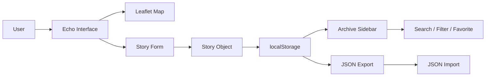

# 📍 ECHO

### Personal Memories · Interactive Maps · Privacy-First Frontend

[](https://developer.mozilla.org/en-US/docs/Web/HTML)
[](https://developer.mozilla.org/en-US/docs/Web/CSS)
[](https://developer.mozilla.org/en-US/docs/Web/JavaScript)
[](https://leafletjs.com/)
[](#privacy--data)

> **Your world, in stories.**  
> Echo is a browser-based memory map where people can pin personal stories to real-world locations and keep those stories on their own device.

---

## ✦ What is Echo?

Echo turns a map into a personal story archive.

Users can select a location, write a memory, optionally attach a photo, and save it locally in the browser. Stories can then be searched, filtered, favorited, edited, deleted, exported, or restored.

The project focuses on a simple idea:

**A place can hold a memory.**

---

## 🗺️ Experience

- Interactive world map powered by Leaflet
- Click-to-place memory pins
- Current-location support
- Story archive sidebar
- Search and filtering
- Favorites
- Random story discovery
- Story editing and deletion
- Optional photo attachments
- JSON export/import
- Responsive mobile layout
- Local-first browser storage

---

## 🔐 Privacy & Data

Echo is designed around a local-first model.

Stories are stored using the browser's **localStorage**, meaning the project does not require a traditional backend or database for its core experience.

```text
User
  │
  ├── Create story
  ├── Add location
  └── Add optional photo
          │
          ▼
     localStorage
          │
          ▼
     Echo archive
```

### Important

"Private" here means the application stores its data locally rather than sending it to a project backend. Browser storage is not a substitute for strong encryption or a secure vault.

---

## ⚙️ How It Works



### Story lifecycle

1. Choose **Drop an Echo**
2. Click a location on the map
3. Add a title and story
4. Optionally add a name and photo
5. Save the Echo
6. The story appears on the map and archive
7. Edit, favorite, delete, export, or restore it later

---

## 🧩 Feature Highlights

### 📍 Location-based stories
Every Echo is connected to latitude and longitude coordinates.

### 📝 Personal story archive
The sidebar turns saved memories into a searchable archive.

### 🔎 Search & filters
Search by title, story, or author and filter by recent or favorite entries.

### ⭐ Favorites
Important memories can be marked as favorites for quick access.

### 🖼️ Photo support
Users can attach an optional image to a memory. Images are stored as data URLs in browser storage.

### 💾 Backup system
Echo can export stories as JSON and import them again later.

### 📱 Responsive interface
The layout adapts for smaller screens with a mobile sidebar and compact controls.

---

## 🛠️ Technology Stack

| Technology | Purpose |
|---|---|
| **HTML5** | Application structure |
| **CSS3** | UI, layout, animations, responsive design |
| **JavaScript** | Application logic and state management |
| **Leaflet.js** | Interactive mapping |
| **OpenStreetMap** | Map tiles |
| **localStorage** | Local story persistence |
| **Geolocation API** | Current-location functionality |
| **FileReader API** | Photo and JSON import handling |

---

## 📁 Project Structure

```text
echo/
├── index.html      # Main application interface
├── styles.css      # Visual system and responsive layout
├── script.js       # Map, stories, storage and interactions
└── favicon.svg     # Browser icon
```

---

## 🚀 Run Locally

Clone the repository and serve it with any static HTTP server.

### Python

```bash
git clone https://github.com/btwsalts/echo.git
cd echo
python3 -m http.server 8000
```

Then open:

```text
http://localhost:8000
```

A local server is preferable to opening `index.html` directly because browser APIs such as geolocation can behave differently under `file://`.

---

## 🧠 What I Practiced

This project demonstrates practical experience with:

- DOM manipulation
- JavaScript state management
- Browser storage
- Geolocation
- File APIs
- JSON serialization
- Form handling
- Event-driven interfaces
- Map integration
- Responsive CSS
- Modal interfaces
- Client-side data persistence
- HTML escaping and basic input handling

---

## 🔭 Roadmap

Potential future improvements:

- [ ] Optional encrypted local storage
- [ ] Backend synchronization
- [ ] User accounts
- [ ] Cloud backup
- [ ] Offline map support
- [ ] Story categories and tags
- [ ] Timeline view
- [ ] Shareable Echo links
- [ ] Better photo compression
- [ ] Progressive Web App support

---

## 💼 Portfolio Value

Echo is a useful portfolio project because it combines several frontend concepts in one application rather than being only a static webpage.

It demonstrates how a browser application can combine:

**UI → Maps → Location → State → Storage → File handling → Responsive design**

It also gives room to discuss privacy, data ownership, browser APIs, and the trade-offs of a local-first architecture.

---

## 📌 Technical Notes

- Seed stories are included so the map has content on first launch.
- User-created stories persist through browser localStorage.
- Imported backups replace the current local archive after confirmation.
- Photos are stored as data URLs, so large images can consume browser storage quickly.
- Map functionality depends on Leaflet and OpenStreetMap resources being reachable.
- The project is currently a frontend application and does not have a server-side database.

---

## 📄 License

No license has currently been added to this repository. Add an explicit license before presenting the project as reusable open-source software.

---

<p align="center">
  <strong>Echo</strong> · Places remember. Stories remain.
</p>
